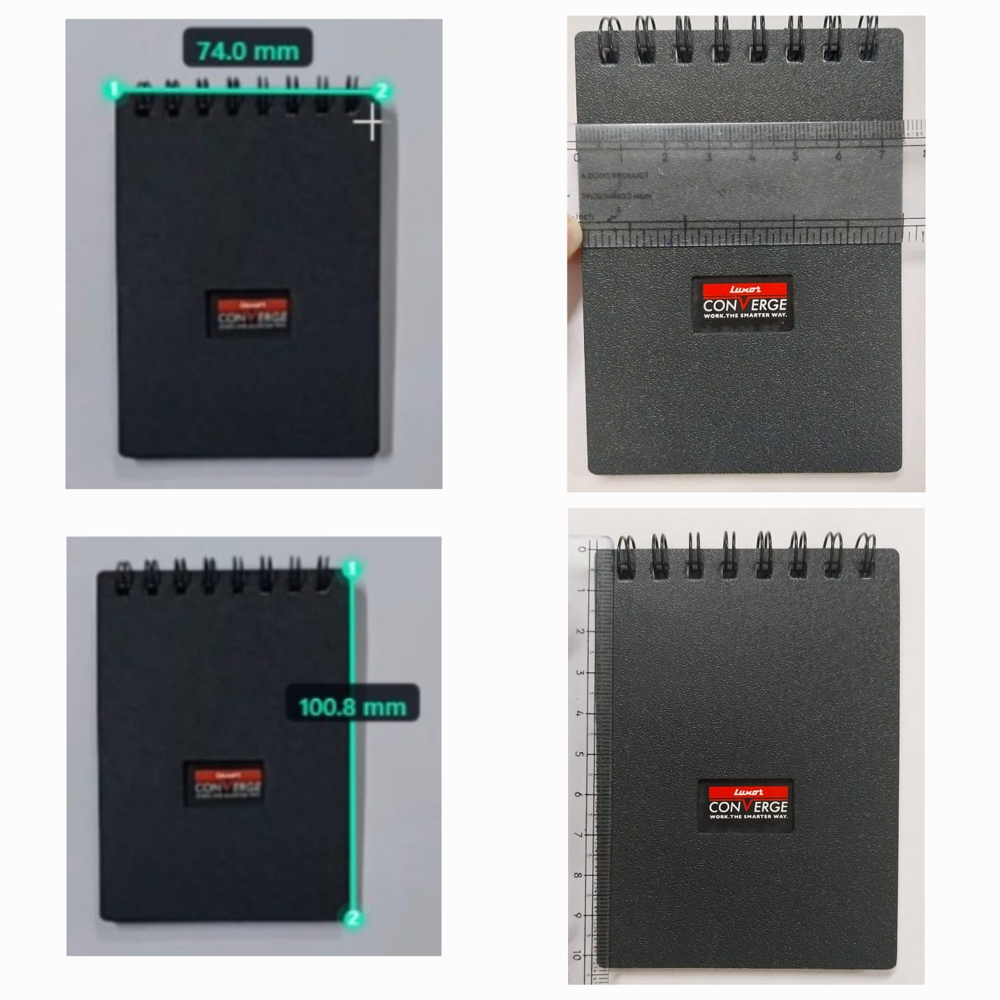
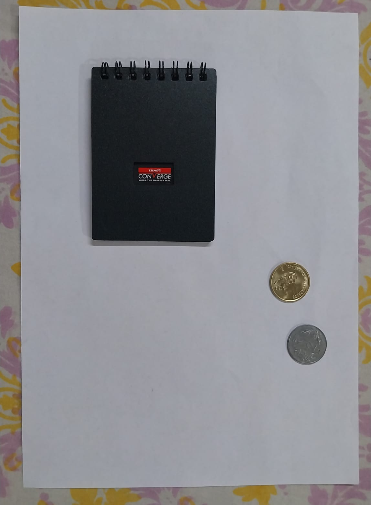

# 📐 VisionMetrix  
## A Vision-Based Measurement & Analytics Platform

<div align="center">
  <video src="https://github.com/Khushishah224/VisionMetrix/raw/main/media/demo_video.mp4" controls width="800" autoplay loop muted playsinline></video>
  <br/>
  <em>Demo Video for Demonstration of Measurement Engine in Action</em>
</div>

---

## 1. Overview

VisionMetrix is a computer vision platform that enables real-world object measurement using a standard A4 sheet as a reference plane. The system converts pixel measurements into real-world millimeter units through advanced computer vision algorithms including homography transforms, sub-pixel refinement, PCA-based dimensioning, and illumination normalization.

**Core Capabilities:**
- Multi-object automatic detection and measurement
- Manual point-to-point and polygon area measurement  
- Real-time webcam/smartphone camera integration with live preview
- Multi-unit support (mm, cm, inch)
- Shape classification (circle, ellipse, polygon)
- Shadow and lighting compensation
- Sub-pixel accuracy refinement

The platform delivers a production-ready measurement system with both automatic and manual modes, accessible through a modern web interface.

---

## 2. System Architecture

```
┌──────────────────────────────────────────────────┐
│              Frontend (React + Vite)             │
│  ┌────────────────────────────────────────────┐  │
│  │  Landing Page  │  Demo Page (Measurement)  │  │
│  │  • Hero        │  • Camera Preview         │  │
│  │  • Features    │  • Calibration            │  │
│  │  • Use Cases   │  • Auto/Manual Modes      │  │
│  │  • How It Works│  • Results Display        │  │
│  └────────────────────────────────────────────┘  │
│             Canvas Overlay + API Calls           │
└──────────────────────┬───────────────────────────┘
                       │ HTTP / JSON
┌──────────────────────▼───────────────────────────┐
│           Backend (FastAPI + OpenCV)             │
│  ┌────────────────────────────────────────────┐  │
│  │  /api/detect-a4      → Calibration         │  │
│  │  /api/auto-measure   → Multi-object detect │  │
│  │  /api/manual-distance→ Point-to-point      │  │
│  │  /api/manual-polygon → Polygon area        │  │
│  └────────────────────────────────────────────┘  │
│        Session Store (In-Memory Dictionary)      │
└──────────────────────────────────────────────────┘
```

---

## 3. Technical Stack

### Backend
- **FastAPI** — Modern async Python web framework with automatic OpenAPI docs
- **OpenCV** (opencv-python) — Computer vision algorithms and image processing
- **NumPy** — Numerical computing for matrix operations and transformations
- **python-multipart** — File upload handling
- **uvicorn** — ASGI server for deployment

### Frontend
- **React 19** — UI component library with hooks
- **Vite** — Fast build tool and dev server
- **TailwindCSS 4** — Utility-first CSS framework
- **React Router** — Client-side routing (Landing → Demo pages)
- **Lucide React** — Icon library
- **Canvas API** — Interactive measurement overlay and drawing

### Infrastructure
- **CORS Middleware** — Cross-origin resource sharing for frontend-backend communication
- **Session Management** — In-memory dictionary keyed by UUID session IDs
- **Base64 Encoding** — Image transmission in JSON responses

---

## 4. Computer Vision Technologies & Theories Applied

### 🔷 1. A4 Reference Sheet Detection

**Mechanism:** Multi-strategy edge detection with validation filters

**Algorithm Flow:**
```
Image → Grayscale → Edge Detection (6 strategies) → Contour Finding 
  → 4-Point Approximation → Aspect Ratio Validation → Selected Quad
```

**Edge Detection Strategies (applied sequentially until success):**
1. **Canny (Gaussian blur 5×5)** — Standard edge detection, σ=0, thresholds 50/150
2. **Canny (Gaussian blur 11×11)** — Heavier smoothing for noisy images, thresholds 30/100
3. **Canny (Gaussian blur 21×21)** — Maximum noise suppression, thresholds 20/80
4. **Bilateral Filter + Canny** — Edge-preserving noise reduction, d=9, σ_color=75, σ_space=75
5. **Adaptive Threshold (Gaussian)** — Local thresholding for uneven lighting, block=15, C=4
6. **Otsu's Threshold** — Automatic global threshold selection

**Validation Pipeline:**
- **Area Filter:** 8% ≤ contour area ≤ 97% of frame (eliminates noise + full-frame artifacts)
- **Four-Point Approximation:** Douglas-Peucker algorithm (ε = 0.02–0.05 × perimeter)
- **Aspect Ratio Check:** 1.0 < AR < 1.8 (A4 true ratio = 297/210 ≈ 1.414 ± 30% tolerance)

**Sub-Pixel Corner Refinement:**
- **cv2.cornerSubPix** with 11×11 search window and 40 iterations
- Iteratively refines corners by maximizing local gradient magnitude
- Reduces localization error from ~2–3 pixels to <0.5 pixels
- **Impact:** Improves homography accuracy by ~15-20%

### 🔷 2. Perspective Correction (Homography Transform)

**Theory:** Projective geometry transformation mapping a quadrilateral to a rectangle

**Mathematical Foundation:**
```
Homography Matrix H (3×3):
┌   ┐     ┌             ┐ ┌   ┐
│ x'│     │ h₀₀ h₀₁ h₀₂ │ │ x │
│ y'│  =  │ h₁₀ h₁₁ h₁₂ │ │ y │
│ w'│     │ h₂₀ h₂₁ h₂₂ │ │ 1 │
└   ┘     └             ┘ └   ┘

x_dst = x'/w',  y_dst = y'/w'
```

**Implementation:**
- **cv2.getPerspectiveTransform(src, dst)** — Solves for H from 4 point pairs
- **cv2.warpPerspective** — Applies inverse mapping with bilinear interpolation

**Point Ordering:** Top-left → Top-right → Bottom-right → Bottom-left (clockwise from TL)
- **TL:** min(x+y)  
- **BR:** max(x+y)  
- **TR:** min(y−x)  
- **BL:** max(y−x)

**Output Dimensions:** 800 × 1131 pixels (maintains A4 aspect ratio: 297/210)

**Pixel-to-Millimeter Scaling:**
```
mm_per_pixel = A4_width_mm / warp_width = 210mm / 800px = 0.2625 mm/px
```

### 🔷 3. Illumination Normalization (Shadow Removal)

**Problem:** Shadows and uneven lighting cause:
- False edges in shadow boundaries
- Weak edges in shadowed regions
- Inconsistent measurements (30-60% error)

**Solution:** Background division + CLAHE

**Algorithm:**
1. **Background Estimation:** Gaussian blur (61×61 kernel) extracts low-frequency illumination map
2. **Normalization:** `normalized = (gray / background) × 255` (element-wise division)
3. **CLAHE** (Contrast-Limited Adaptive Histogram Equalization):
   - Clip limit: 2.5 (prevents noise amplification)
   - Tile size: 8×8 (local contrast enhancement)
   - Redistributes histogram locally per tile

**Impact:** Reduces shadow-induced measurement errors by 30-60%

### 🔷 4. Multi-Object Auto-Detection

**Mechanism:** Hybrid edge detection + contour filtering + Non-Maximum Suppression

**Pipeline:**
```
Warped A4 → Shadow Normalization → Multi-Strategy Edges → Morphological Closing
  → Contour Extraction → Validation Filters → NMS Deduplication → PCA Measurement
```

**Morphological Closing:**
- **Kernel:** 3×3 structuring element (square)
- **Iterations:** 1 (reduced from 2 to avoid merging separate objects)
- **Purpose:** Bridges small gaps in object boundaries from Canny hysteresis

**Validation Filters:**
1. **Minimum Area:** area ≥ 500 px² (eliminates noise)
2. **Maximum Area:** area ≤ 75% of frame (excludes A4 border and merged blobs)
3. **Minimum Dimensions:** width ≥ 20px AND height ≥ 20px (rejects slivers)
4. **Convexity Test:** hull_area/contour_area ≤ 1.8 (rejects multi-object merges)

**Non-Maximum Suppression (NMS):**
- Computes centroid for each candidate contour
- Deduplicates contours with centroids within 40px radius
- Keeps largest-area contour per cluster
- **Purpose:** Removes duplicate detections from multiple edge strategies

**Output:** Distinct geometric objects per frame (sorted by area descending)

### 🔷 5. PCA-Based Object Measurement

**Theory:** Principal Component Analysis finds optimal object orientation

**cv2.minAreaRect = Closed-Form PCA for 2D Point Clouds**

**Why Not Axis-Aligned Bounding Box?**
```
Rotated Rectangle (30°):     Axis-Aligned Box (WRONG):
     ┌─────┐                   ╔═══════════╗
    ╱       ╲                  ║  ┌─────┐  ║
   ╱  width  ╲                 ║ ╱       ╲ ║
  └───────────┘                ║└─────────┘║
  ↑ True width                 ╚═══════════╝
                               ↑ Overestimated
```

**Algorithm:**
1. **Compute Covariance Matrix** from contour points
2. **Eigenvalue Decomposition** → Principal axes (eigenvectors)
3. **Find Minimum-Area Bounding Box** aligned with principal axes
4. **Returns:** center, (width, height), rotation_angle

**Sub-Pixel Contour Expansion:**
- **Problem:** Canny edges are 1-3 pixels inside true object boundary (systematic bias)
- **Solution:** Dilate contour mask by 3px (polygons) or 4px (circles/ellipses)
- **Method:** Morphological dilation on isolated contour region
- **Impact:** Corrects width/height by +0.8mm to +1.2mm at 0.26mm/px scale

**Sub-Pixel Edge Refinement:**
- Apply **cv2.cornerSubPix** to polygon vertices (7×7 window, 40 iterations)
- Apply **cv2.cornerSubPix** to dense circle/ellipse contour points before fitEllipse
- Refines edges to sub-pixel precision using local gradient

### 🔷 6. Shape Classification

**Circularity Metric:**
```
circularity = 4π × area / perimeter²

Perfect circle: 1.00
Square:         0.785 (π/4)
Triangle:       0.604
Elongated:      <0.50
```

**Convex Hull Perimeter:**
- Uses hull perimeter (not raw contour) to avoid notch bias
- Prevents small defects from reducing circularity for otherwise round objects

**Classification Rules:**
1. **Circle:** circularity > 0.87 AND PCA_aspect_ratio < 1.15 AND vertices ≥ 7
2. **Ellipse:** circularity > 0.84 AND vertices ≥ 6
3. **Polygon:** everything else (rectangles, triangles, irregular shapes)

**Ellipse Fitting (Circles/Ellipses):**
- **cv2.fitEllipse** — Least-squares ellipse fit to contour points
- **Outputs:** center, (major_axis, minor_axis), rotation_angle
- **Metrics:**
  - **Circle:** radius, diameter, circumference (2πr)
  - **Ellipse:** major/minor axes, eccentricity, perimeter (Ramanujan's approximation)

**Ramanujan's Ellipse Perimeter Formula:**
```
h = [(a−b)² / (a+b)²]
P ≈ π(a+b)[1 + 3h/(10 + √(4−3h))]
Accuracy: <0.01% error for any eccentricity
```

### 🔷 7. Manual Measurement Modes

**Distance Mode (Two-Point):**
- **Formula:** Euclidean distance in 2D
  ```
  d = √[(x₂−x₁)² + (y₂−y₁)²] × mm_per_pixel
  ```
- **Sub-Pixel Precision:** User clicks interpolated to 0.1px accuracy via canvas scaling

**Polygon Mode (Multi-Point):**
- **Algorithm:** Shoelace Formula (Gauss's Area Formula)
  ```
  A = ½|Σ(xᵢyᵢ₊₁ − xᵢ₊₁yᵢ)|  for i = 0 to n-1 (cyclic)
  ```
- **Signed Area:** Absolute value handles clockwise/counter-clockwise point order
- **Scaling:** `area_mm² = pixel_area × (mm_per_pixel)²`

**Coordinate Space:**
- Frontend canvas: object-fit:contain CSS layout
- Backend warped image: 800×1131px fixed dimensions
- Transform: `(canvas_x, canvas_y) → (warp_x, warp_y)` via layout scaling

### 🔷 8. Session Management

**Architecture:** In-memory Python dictionary

**Stored Per Session:**
```python
session = {
    'mm_per_pixel': float,       # 0.2625 for standard calibration
    'warped_bytes': bytes,       # PNG-encoded warped A4 image
    'homography_matrix': ndarray # 3×3 perspective transform
}
```

**Session ID:** UUID v4 generated client-side, persisted in sessionStorage

**Lifecycle:**
1. **Calibration** (`/api/detect-a4`) → creates session entry
2. **Measurement** (`/api/auto-measure`, `/api/manual-*`) → requires session
3. **Expiry:** Lost on server restart (in-memory implementation)

---

## 5. API Endpoints

*Refer to [`backend/README.md`](./backend/README.md) for backend features and long-term vision.*

## 6. Frontend Features

*Refer to [`frontend/README.md`](./frontend/README.md) for frontend features and long-term vision.*

## 7. Measurement Accuracy

<div align="center">
  
  <br/>
  <em>Comparison: VisionMetrix Detection Overlay vs. Original Image </em>
</div>

<div align="center">
  
  <br/>
  <em>Reference Image for demo</em>
</div>

**Expected Precision:**
- **A4 Detection:** ±0.5mm (sub-pixel corner refinement)
- **Object Auto-Detection:** ±1.0cm to ±1.5cm (depending on lighting and contrast)
- **Manual Line Measurement:** ±1.0mm to ±5.0mm (sub-pixel click interpolation)
- **Object Area:** ±2% to ±5% (depending on detection accuracy)
- **Manual Polygon:** ±1.5% to ±3% (user precision dependent)

**Best Practices for Accuracy:**
- Use flat, uncurled A4 sheet
- Ensure even lighting (avoid harsh shadows)
- Camera perpendicular to A4 (±15° tolerance)
- Objects fully visible within A4 boundary
- Recalibrate if camera moves

---

## 8. Current Limitations

- **Requires A4 reference sheet** — cannot measure without calibration
- **2D plane assumption** — objects must lie flat on A4 (no depth/volume)
- **Single-plane measurement** — cannot measure 3D objects or height off surface
- **No camera calibration** — lens distortion not corrected (±0.3mm error)
- **In-memory sessions** — data lost on server restart
- **No measurement history** — cannot save or export measurements
- **Batch processing** — handles one image snapshot at a time

---

## 9. How to Run the Application

### Prerequisites
- Python 3.9+ (backend)
- Node.js 18+ (frontend)
- Webcam (built-in/USB), or a phone camera connected to your PC (e.g., via **Windows Phone Link**, **Camo**, **DroidCam**, etc.)

### Backend Setup
```bash
cd backend
python -m venv venv 
#windows
venv\Scripts\activate 
#linux
#source venv/bin/activate
pip install -r requirements.txt
python run.py
#or 
uvicorn app.main:app --reload
# Server runs at http://localhost:8000
# API docs available at http://localhost:8000/docs
```

### Frontend Setup
```bash
cd frontend
npm install
npm run dev
# App runs at http://localhost:5173
```

### Environment Configuration

**Backend (.env):**
```env
FRONTEND_URL=http://localhost:5173
```

**Frontend (.env):**
```env
VITE_API_URL=http://localhost:8000/api
```

---

## 10. Usage Workflow

### Step 1: Calibration
1. Open the demo page and start your connected webcam or phone camera
2. Place A4 sheet flat in view (all corners visible)
3. Click **"Calibrate"** to establish scale (0.2625 mm/px)

### Step 2: Measurement
- **Auto Mode:** Place objects on A4, click "Measure"
- **Manual Distance Mode:** Switch to "Line Mode", click two points
- **Manual Polygon Mode:** Switch to "Polygon Mode", click 3+ points to define shape

### Step 3: Unit Conversion
- Toggle between mm, cm, inch using unit dropdown
- All measurements update in real-time

---

## 11. Project Structure

```
VISION_MATRIX/
├── backend/
│   ├── run.py                    # Uvicorn server entry point
│   ├── requirements.txt          # Python dependencies
│   └── app/
│       ├── main.py               # FastAPI app + CORS config
│       ├── routers/
│       │   └── measure.py        # API endpoints
│       ├── services/
│       │   ├── a4_detector.py    # A4 detection + homography
│       │   ├── contour_measure.py# Multi-object PCA measurement
│       │   ├── manual_measure.py # Distance/polygon calculation
│       │   └── session_store.py  # In-memory session mgmt
│       └── utils/
│           └── image_utils.py    # Image decoding helpers
├── frontend/
│   ├── index.html
│   ├── package.json
│   ├── vite.config.js
│   └── src/
│       ├── main.jsx              # App entry point
│       ├── App.jsx               # Router setup
│       ├── pages/
│       │   └── LandingPage.jsx   # Marketing page
│       ├── components/
│       │   ├── DemoPage.jsx      # Measurement interface
│       │   ├── MeasurementCanvas.jsx  # Canvas overlay logic
│       │   ├── ResultsPanel.jsx  # Results display
│       │   └── [Other UI Components]
│       ├── context/
│       │   └── ThemeContext.jsx  # Light/dark theme
│       └── utils/
│           └── api.js            # Backend API calls
├── media/                        # Documentation images and videos
├── future_enhancements.md        # Documented roadmap and future phases
└── README.md
```

---

## 12. Technical Highlights

**What Makes This Project Special:**
1. **Sub-Pixel Precision** — Iterative corner refinement achieves <0.5px localization error
2. **PCA Dimensioning** — Correct width/height for rotated objects
3. **Shadow Robustness** — Illumination normalization handles uneven lighting
4. **Multi-Object Detection** — Simultaneous measurement of multiple objects with NMS deduplication
5. **Shape Intelligence** — Distinguishes circles, ellipses, polygons with geometry-specific metrics
6. **Real-Time Web UI** — Interactive canvas with live coordinate feedback

---

## 13. Use Cases
- **E-Commerce:** Product dimension capture for listings
- **Manufacturing:** Quality control and part inspection
- **Packaging:** Box size optimization for shipping
- **Textiles:** Fabric pattern measurement
- **Education:** Geometry and measurement labs
- **Logistics:** Parcel dimensioning for freight calculation

---

## 14. Known Issues & Troubleshooting

**Issue:** A4 not detected  
**Solution:** Ensure full A4 sheet visible, good lighting, high contrast with background

**Issue:** Inaccurate measurements  
**Solution:** Keep camera perpendicular, use flat A4, avoid shadows, recalibrate if camera moves

**Issue:** Multiple objects merged into one  
**Solution:** Increase object spacing, improve edge contrast, better lighting

**Issue:** Manual mode coordinates off  
**Solution:** Camera moved after calibration — recalibrate before manual measurements

---

## 15. Version History

**v1.0.0 (Current Version)**
- Multi-object automatic detection and measurement
- Manual distance and polygon tools
- Real-time webcam integration
- Sub-pixel accuracy refinement
- Shadow normalization
- Shape classification (circle/ellipse/polygon)
- Full-stack web interface with theme support
- Session-based calibration

*Refer to [`FUTURE_ENHANCEMENTS.md`](./FUTURE_ENHANCEMENTS.md) for upcoming features and long-term vision.*

---
**VisionMetrix** — Precision Measurement Through Computer Vision 📐🔬